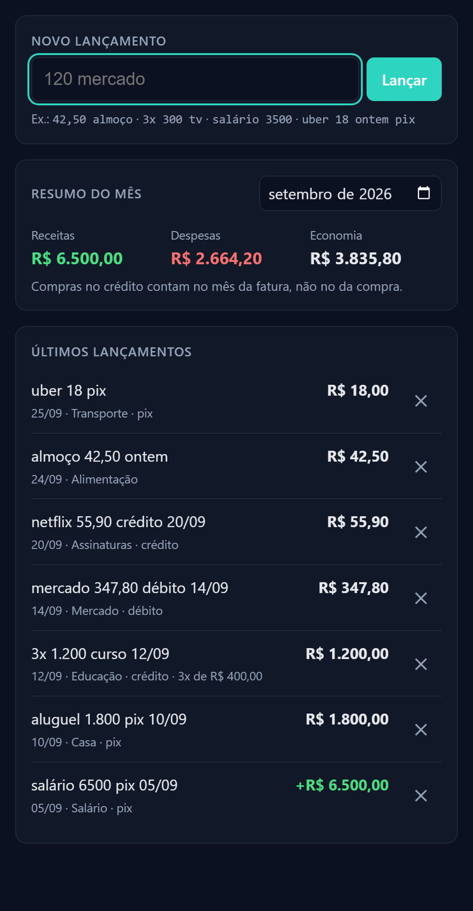
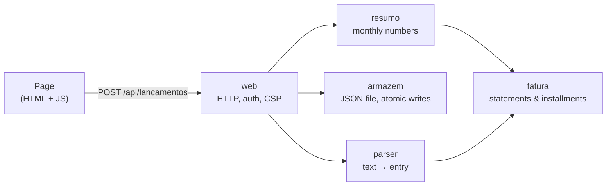

# Finance Platform

[](https://github.com/augustodbatista/finance-platform/actions/workflows/ci.yml)


[](LICENSE)

**A personal finance tracker where logging an expense takes one line of text.**

You type what you would say out loud — `almoço 42,50`, `3x 1.200 curso`,
`uber 18 ontem pix` — and it becomes a structured entry: amount, category, date,
payment method and installments. The monthly summary knows that a credit card
purchase counts on the statement it lands on, not on the day you bought it.

<p align="center">
  
</p>

> The interface is in Brazilian Portuguese because the product is built for
> Brazilian users: pt-BR number formats (`1.234,56`), Pix, and credit card
> installments (*parcelas*) are first-class concepts.

## Why

Most finance apps fail at the first step: logging takes too long, so people stop.
This project is built around one hypothesis — **friction kills habit** — and every
design decision answers the same question: *does this make logging an expense
faster or slower?*

## What the parser understands

| You type | Amount | Category | Payment | Date |
|---|---|---|---|---|
| `120 mercado` | R$ 120,00 | Mercado (groceries) | — | today |
| `almoço 42,50 ontem` | R$ 42,50 | Alimentação (food) | — | yesterday |
| `R$ 1.234,56 aluguel pix` | R$ 1.234,56 | Casa (home) | Pix | today |
| `3x 1.200 curso 12/09` | R$ 1.200,00 in 3 × R$ 400,00 | Educação | credit (inferred) | Sep 12 |
| `salário 6500` | +R$ 6.500,00 | Salário (income) | — | today |
| `mercado` | *error: "Não encontrei o valor"* | | | |

Unknown words fall into *Outros* (other) instead of failing — asking the user
"which category?" costs more than a slightly wrong category.

## Engineering highlights

- **Money is `int64` cents, never `float64`.** Parsing builds the cents string
  and converts once, so overflow is an error instead of a silent wraparound.
- **Credit card statements modeled correctly.** A purchase on the closing day
  goes to the next statement; installments split with the remainder on the first
  one, and *the installments always add up to the total* — tested as an
  invariant over 89 combinations of totals and installment counts.
- **A class of silent bugs found and fixed.** With the "last number wins" rule,
  `mercado 120 15/03` was being read as **R$ 0,03** — no error, just a wrong
  number. Dates and installment tokens are now stripped *before* the amount is
  extracted, and every such input is a regression test.
- **Crash-safe persistence.** Atomic writes (temp file + rename); in-memory
  state only changes after the disk confirms; a corrupted file is an error,
  never "start empty and overwrite"; IDs are never reused.
- **Security handled where the surface appears**, each with a test: password
  required off loopback, constant-time comparison, CSRF blocked by requiring
  `application/json`, XSS prevented by `textContent` plus a strict CSP, request
  size limits and server timeouts. Go's RE2 regex engine makes the parser immune
  to ReDoS.
- **Zero external dependencies.** Standard library only; `go.sum` is empty.
- **CI on every commit:** gofmt, golangci-lint with gosec, tests with the race
  detector, govulncheck, osv-scanner and semgrep. Both times `main` went red --
  wrong action pins at bootstrap, and standard library CVEs published months
  later -- the cause and the fix are recorded in CLAUDE.md.

| | |
|---|---|
| Tests | 157 test cases across 54 test functions |
| Coverage | 100% on `parser`, `fatura`, `resumo`; 98.9% `web`; 90.4% `armazem` |
| Size | ~1,300 lines of Go + ~1,300 lines of tests + ~300 lines of HTML/CSS/JS |

## Architecture



The domain packages (`parser`, `fatura`, `resumo`) are pure: no I/O, no clock
(time is passed in), testable with `go test` alone. I/O lives at the edges
(`armazem`, `web`, `cmd/app`).

```
api/
├── cmd/app/            entry point and configuration
└── internal/
    ├── parser/         natural-language input → Lancamento
    ├── fatura/         which statement a purchase lands on; installment split
    ├── resumo/         income, expenses and savings for a month
    ├── armazem/        JSON persistence
    └── web/            HTTP handlers + embedded page (static/)
docs/decisions/         RFC-0001 (target stack) and ADR-0001 (MVP deviation)
```

## Running it

Requires Go 1.26+.

```bash
cd api
FINANCE_DIA_FECHAMENTO=28 go run ./cmd/app
```

Open <http://127.0.0.1:8080>. To use it from a phone on the same network, listen on
all interfaces — a password is then mandatory, and the log prints the address to
open:

```bash
FINANCE_DIA_FECHAMENTO=28 FINANCE_ENDERECO=0.0.0.0:8080 FINANCE_SENHA=change-this-password go run ./cmd/app
```

| Variable | Purpose | Default |
|---|---|---|
| `FINANCE_DIA_FECHAMENTO` | Credit card closing day, 1–31 | **required** |
| `FINANCE_ENDERECO` | Listen address | `127.0.0.1:8080` |
| `FINANCE_DADOS` | Data file path | `dados.json` |
| `FINANCE_SENHA` | Password (8+ chars) | required off loopback |

Tests and lint:

```bash
cd api
go test -race -cover ./...
go run github.com/golangci/golangci-lint/v2/cmd/golangci-lint@latest run ./...
```

## Design decisions

Decisions are written down before code, including the ones that deviate from the
plan:

- [RFC-0001](docs/decisions/rfc-0001-escolha-da-stack.md) — target stack: Flutter,
  Go, PostgreSQL, Supabase.
- [ADR-0001](docs/decisions/adr-0001-mvp-binario-go.md) — why the MVP is a single Go
  binary with an HTML page and a JSON file instead, and the four triggers that
  bring the project back to the RFC stack.

Commit messages explain *why*, not *what*: the history reads as a log of
decisions and the bugs they prevented.

## How it was built

This project was built with an AI pair programmer ([Claude Code](https://claude.com/claude-code))
under Extreme Programming rules written in [CLAUDE.md](CLAUDE.md): I set direction,
make product and architecture decisions, and review; the AI implements, and is
expected to question decisions and raise risks and edge cases. Test-first on every
change, green CI on every commit, small releases. CLAUDE.md doubles as the
project's living engineering notes, including a *Common Hurdles* log of every
non-obvious problem hit along the way.

## Current limits and roadmap

The MVP is deliberately small ([ADR-0001](docs/decisions/adr-0001-mvp-binario-go.md)):

- Runs on a PC; the phone connects over the local network. No TLS, so it is meant
  for a home network only.
- Single user, single credit card.
- No editing (delete and retype), no current balance yet, manual backups.

Next steps, in order: hosting with HTTPS and login rate limiting; accounts and
statement payments (which unlock the current balance); PostgreSQL and the Flutter
app from RFC-0001.

## Glossary

Identifiers are in Portuguese, the domain's language. Comments and docs are in
English.

| Term | Meaning |
|---|---|
| `lançamento` | entry (an expense or income) |
| `centavos` | cents |
| `receita` / `despesa` | income / expense |
| `fatura` | credit card statement |
| `competência` | the month a statement belongs to |
| `fechamento` | statement closing day |
| `parcela` | installment |
| `forma de pagamento` | payment method (`pix`, `débito`, `crédito`, `dinheiro`) |
| `resumo` | summary |
| `armazém` | store (persistence) |

## License

[MIT](LICENSE)
